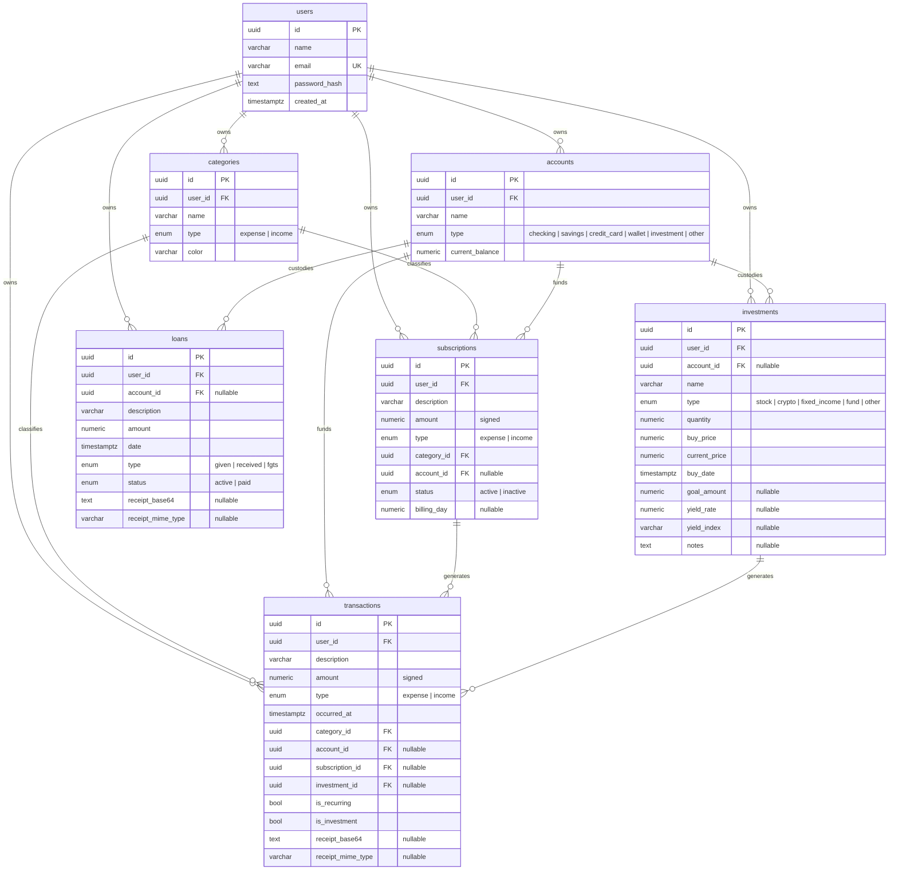

# Data model

Canonical source: `packages/shared/src/db/schema.ts`. This document explains the
**shape and intent**; the schema file is the source of truth for column types.

## ER diagram

## Indexes (what they're for)

| Index                                     | Query it accelerates                          |
| ----------------------------------------- | --------------------------------------------- |
| `transactions_user_occurred_idx`          | "list my transactions in this period"         |
| `transactions_user_type_occurred_idx`     | filter chips ("only despesas this month")     |
| `transactions_category_idx`               | dashboard ranking aggregation                 |
| `transactions_account_idx`                | per-account statements                        |
| `transactions_subscription_idx`           | find transactions for a given subscription    |
| `categories_user_name_type_uq`            | prevent dup categories per user per type      |
| `subscriptions_user_idx`                  | list subscriptions for a user                 |
| `investments_user_idx`                    | list investments for a user                   |
| `investments_account_idx`                 | list investments linked to an account         |
| `loans_user_idx`                          | list loans for a user                         |

## Conventions

- All primary keys: `uuid` with `defaultRandom()`.
- All money fields: `numeric(14,2)`. Never `double`. Drizzle returns these
  as strings — coerce with `Number()` only when computing aggregates;
  store and return them as strings/decimals to the client.
- All timestamps: `timestamptz` (`with timezone`). Server logic uses UTC.
- Soft delete is **not used**. Hard deletes with FK cascades / restrict
  where appropriate.
