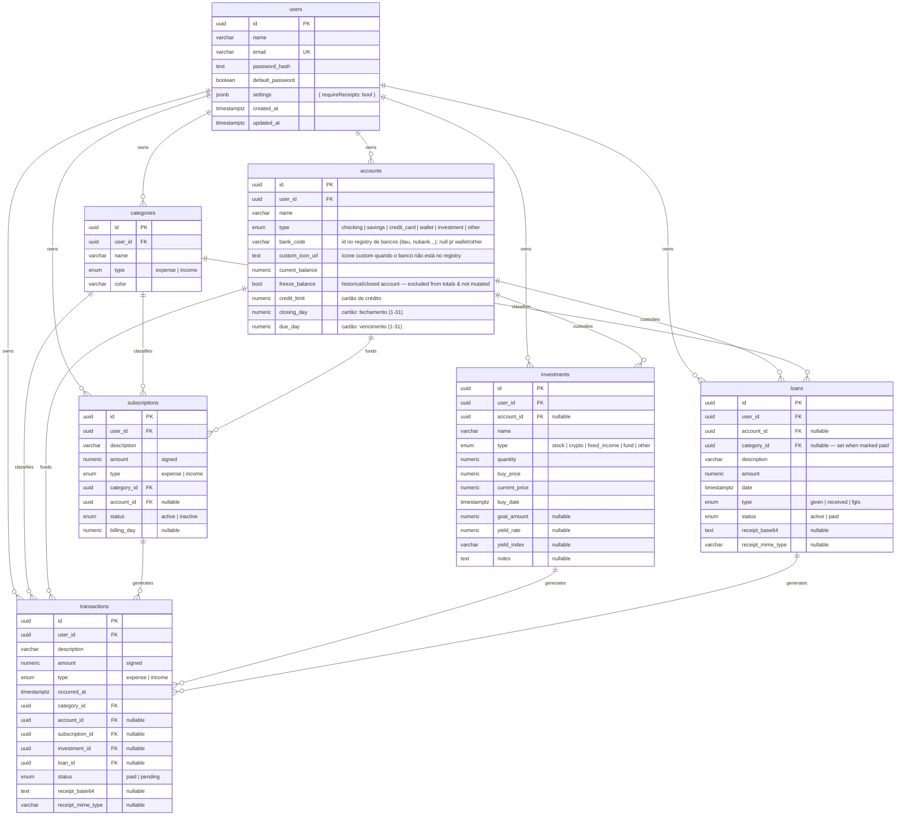

# Data model

Canonical source: `packages/db/src/schema.ts`. This document explains the
**shape and intent**; the schema file is the source of truth for column types.

## ER diagram

## Indexes (what they're for)

| Index                                     | Query it accelerates                          |
| ----------------------------------------- | --------------------------------------------- |
| `transactions_user_occurred_idx`          | "list my transactions in this period"         |
| `transactions_user_type_occurred_idx`     | filter chips ("only despesas this month")     |
| `transactions_category_idx`               | dashboard ranking aggregation                 |
| `transactions_account_idx`                | per-account statements                        |
| `transactions_subscription_idx`           | find transactions for a given subscription    |
| `categories_user_name_type_uq`            | prevent dup categories per user per type      |
| `subscriptions_user_idx`                  | list subscriptions for a user                 |
| `investments_user_idx`                    | list investments for a user                   |
| `investments_account_idx`                 | list investments linked to an account         |
| `loans_user_idx`                          | list loans for a user                         |

## Conventions

- All primary keys: `uuid` with `defaultRandom()`.
- All money fields: `numeric(14,2)`. Never `double`. Drizzle returns these
  as strings — coerce with `Number()` only when computing aggregates;
  store and return them as strings/decimals to the client.
- All timestamps: `timestamptz` (`with timezone`). Server logic uses UTC.
- Soft delete is **not used**. Hard deletes with FK cascades / restrict
  where appropriate.

## Notable columns

- **`accounts.freeze_balance`** (bool, default `false`). A *frozen* account
  (historical / closed, e.g. a cancelled Mercado Pago) keeps its
  `current_balance` as a read-only reference: paid transactions/loans never
  mutate it, and it is **excluded** from the dashboard total balance. The UI
  presents the inverse — a switch labelled "Afeta o saldo": checked = affects
  (`freeze_balance = false`), unchecked = historical (`freeze_balance = true`).
- **`loans.category_id`** + **`transactions.loan_id`**. When a loan is marked
  `paid` (which requires a category and a receipt), the backend creates a mirror
  `transaction` in that category linked back via `transactions.loan_id`, so the
  paid loan shows up in the Livro Caixa under its category. Both FKs are
  `onDelete: set null`.
